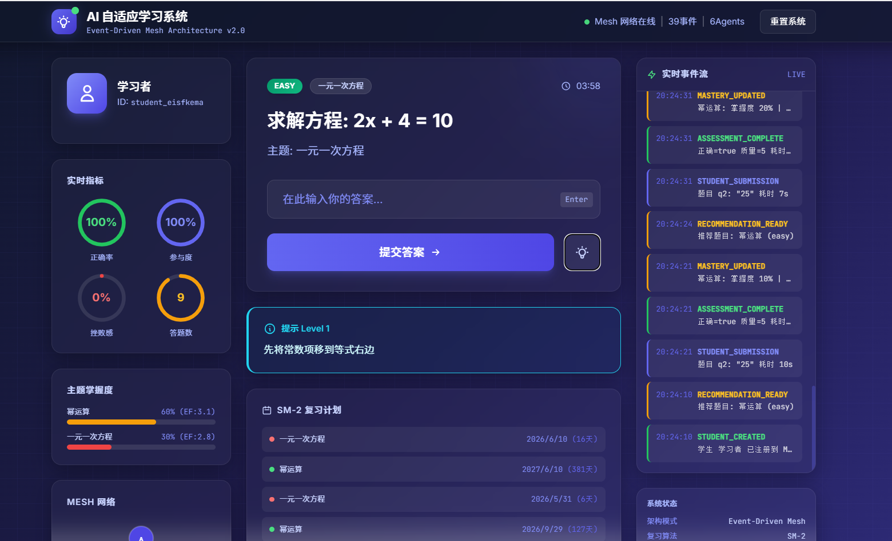

# 🧠 AI 自适应学习系统

> Event-Driven Mesh Architecture | SM-2 间隔重复算法 | 多 Agent 协同

## 架构设计

### 核心特性
- **事件驱动架构**: 基于发布-订阅模式，Agent 间完全解耦
- **Mesh 网络**: 所有 Agent 注册到统一网络，支持动态扩展
- **SM-2 间隔重复**: 根据学习者表现动态调整复习间隔
- **单写者策略**: 掌握度数据仅由 AssessmentAgent 写入，保证一致性
- **事件溯源**: 所有状态变更通过事件记录，支持完整回放
- **开闭原则**: 新增 Agent 无需修改现有代码

### Agent 拓扑

```
                    ┌─────────────────┐
                    │   Event Bus     │
                    │   (Mesh 核心)   │
                    └────────┬────────┘
                             │
        ┌────────────┬───────┴───────┬────────────┐
        │            │               │            │
   ┌────▼────┐ ┌────▼────┐   ┌────▼────┐  ┌────▼────┐
   │Assessment│ │Curriculum│   │  Tutor  │  │Engagement│
   │  Agent   │ │  Agent   │   │  Agent  │  │  Agent   │
   └────┬────┘ └────┬────┘   └────┬────┘  └────┬────┘
        │           │              │            │
   ┌────▼────┐      │         ┌────▼────┐       │
   │  Hint   │      │         │ Parent  │       │
   │  Agent  │      │         │Notification      │
   └─────────┘      │         │  Agent  │       │
                    │         └─────────┘       │
                    └───────────────────────────┘
```

## 核心事件流

### 1. 学生答题流
```
STUDENT_SUBMISSION
    → AssessmentAgent (评估正确性)
    → MASTERY_UPDATED (更新掌握度/SM-2)
    → CurriculumAgent (更新复习计划)
    → ASSESSMENT_COMPLETE
    → TutorAgent (生成苏格拉底式反馈)
    → EngagementAgent (分析学习状态)
        → 如果挫败感 > 0.7 → ENGAGEMENT_ALERT
            → CurriculumAgent (降低难度)
            → TutorAgent (安慰鼓励)
```

### 2. 提示系统流
```
连续答错 >= 2次
    → TutorAgent 检测到
    → HINT_NEEDED
    → HintAgent (判断提示级别 1/2/3)
    → HINT_RESPONSE
    → TutorAgent 转发给学生
```

## 快速开始

### 方式一: 本地运行 (推荐新手)

```bash
# 克隆项目
cd adaptive-learning-system

# 运行演示
python main.py
```

### 方式二: 查看前端界面

直接在浏览器中打开 `frontend/index.html`，可体验交互式答题流程。



## 项目结构

```
adaptive-learning-system/
├── main.py                 # 主入口 & 演示
├── requirements.txt        # 依赖清单
├── README.md              # 项目说明
│
├── events/
│   └── event_bus.py       # 事件总线 (Mesh核心)
│
├── models/
│   ├── schemas.py         # 数据模型 (学生/题目/掌握度)
│   └── sm2.py            # SM-2 间隔重复算法
│
├── database/
│   └── memory_db.py       # 内存数据库 (事件溯源)
│
├── agents/
│   └── core_agents.py     # 核心 Agents 实现
│
└── frontend/
    └── index.html         # 交互式前端界面
```

## Agent 职责说明

| Agent | 职责 | 订阅事件 | 发布事件 |
|-------|------|---------|---------|
| **AssessmentAgent** | 评估答题、更新掌握度(单写者) | STUDENT_SUBMISSION | MASTERY_UPDATED, ASSESSMENT_COMPLETE |
| **CurriculumAgent** | 维护复习计划、推荐题目 | MASTERY_UPDATED, ENGAGEMENT_ALERT | RECOMMENDATION_READY, DIFFICULTY_ADJUSTED |
| **TutorAgent** | 苏格拉底式反馈、检测提示需求 | ASSESSMENT_COMPLETE, HINT_NEEDED | TUTOR_RESPONSE |
| **HintAgent** | 提供分级提示 | HINT_NEEDED | HINT_RESPONSE |
| **EngagementAgent** | 分析参与度、检测挫败感 | ASSESSMENT_COMPLETE | ENGAGEMENT_ALERT |
| **ParentNotificationAgent** | 家长通知 (演示开闭原则) | ENGAGEMENT_ALERT, MASTERY_UPDATED | - |

## SM-2 算法

系统使用 SuperMemo-2 间隔重复算法:

- **质量评分**: 0-5 (0=完全错误, 5=完美)
- **轻松因子(EF)**: 初始 2.5，根据表现调整，最低 1.3
- **间隔递增**: 第1次=1天, 第2次=6天, 之后=前次间隔×EF
- **失败重置**: 答错则间隔重置为1天，重复次数归零

## 扩展指南

### 新增 Agent (开闭原则验证)

新增一个 "家长通知Agent" 只需:

```python
class ParentNotificationAgent(BaseAgent):
    def __init__(self):
        super().__init__("ParentNotificationAgent")
        self.event_bus.subscribe("ENGAGEMENT_ALERT", self.handle_alert)

    async def handle_alert(self, event):
        print(f"通知家长: {event.payload['message']}")
```

**无需修改任何现有 Agent 代码。**

## 状态一致性保证

1. **单写者策略**: `mastery` 只由 AssessmentAgent 写入
2. **事件溯源**: 所有变更通过事件记录，可追溯
3. **版本号**: 每次更新带 version，防止并发冲突

## License

MIT
